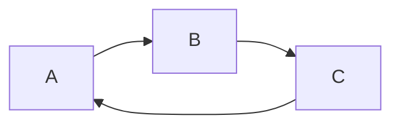
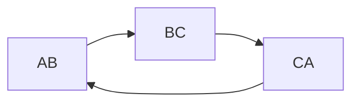
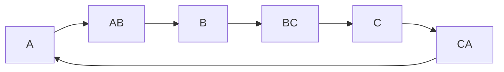

# 数控技术

## 机床的分类

按照机床的**运动轨迹**分，数控机床可以分为：
- 点位数控机床
- 直线数控机床
- 轮廓数控机床

按照所用的**进给伺服系统**的类型分，数控机床可以分为三大类：
- 开环数控系统
- 闭环数控系统  
- 半闭环数控系统

按照所用的**数控装置**类型分类，数控机床可以分为：
- 硬件数控系统 (NC)  
- 计算机数控系统 (CNC)  

按照数控系统**功能水平**分类，数控系统可以分为：
- 经济型数控系统  
- 普及型数控系统  
- 高档型数控系统

按数控**机构**类型分为：
- 串联机构
- 并联机构

## 数控机床的特点

- 广泛的适应性
- 精度高，质量稳定
- 加工生产效率高
- 减轻劳动强度，改善生产条件
- 能实现复杂零件的加工
- 有利于生产管理现代化
- 初始投资大，技术含量高

## 数控机床的应用范围

- 多品种小批量的零件
- 结构比较复杂的零件
- 需要频繁改型的零件
- 价值昂贵的关键零件
- 快速交货的紧急零件

## 数控机床的发展趋势

- 运行高速化
- 加工高精化
- 功能复合化
- 控制智能化
- 体系开放化
- 驱动并联化
- 交互网络化

## 数控设备的重要指标

- 速度 
- 精度

## 机床的组成

机床**基础件**通常是指:
- 床身
- 底座
- 立柱
- 横梁
- 滑座
- 工作台

影响数控机床对传统的机械结构变革的最基本功能和性能主要有以下几个方面：
1. 自动化
2. 大功率和高精度
3. 高速度
4. 工艺复合化和功能集成化
5. 高可靠性

数控机床的机械结构具有不同于普通机床特点和要求，主要体现在以下几个方面：
1. 高的静、动刚度
2. 高灵敏度
3. 高抗振性
4. 热变形小
5. 高效率、无间隙、低摩擦传动
6. 高精度保持性
7. 高可靠性
8. 简化传动链
9. 先进刀具
10. 满足人机工程学的要求

### 传动系统

数控机床主传动系统主要有以下三种配置方式：

1. 带有变速齿轮的主传动
2. 通过带传动的主传动
3. 由伺服电动机直接驱动的主传动
    > 低于特定转速时为恒扭矩输出，高于特定转速时为恒功率输出。
    
### 主轴准停装置

主轴准停装置具有准确定位的功能，将主轴准确地停在某一固定位置，以便在该处进行换刀等动作。

主轴准停装置主要分为**机械方式**和**电气方式**两种。

### 滚珠丝杠螺母副

与普通丝杠螺母副相比，滚珠丝杠螺母副其有以下优点：

1.  传动效率高，摩擦损失小。
2. 运动平稳无爬行。由于摩擦阻力小，动、静摩擦力之差极小，故运动平稳，不易出现爬行现象。
3. 传动精度高，反向时无空程。
4. 磨损小。因摩擦阻力小，磨损小，故精度保持性好，使用寿命长。
5. 运动其有可逆性。由于摩擦系数小，不会自锁，因而不仅可以将旋转运动转换成直线运动，也可将直线运动转换成旋转运动，即丝杠和螺母均可作主动件或从动件。

滚珠丝杠螺母副也有不足的地方，主要有：

1) 结构复杂，且丝杠和螺母等元件的加工精度和表面质量要求高，故制造成本高。

2) 由于不能自锁，特别是在用作垂直安装的滚珠丝杠传动，会因部件的自重而自动下降。当向下驱动部件时，由于部件的自重和惯性，传动切断时，不能立即停止运动，必须增加制动装置。

滚珠的循环方式主要有：
1. 外循环
    > 较为常用
2. 内循环

预紧方式：
1. 双螺母垫片式预紧
2. 双螺母螺纹式预紧

滚珠丝杠的布置方式：
1. 一端固定，一端自由
2. 一端固定，一端浮动
3. 两端固定

减小齿轮间隙的方法有**刚性调推法**和**柔性调整法**两种

### 导轨

按滑动性质分类：

- 滑动导轨
- 滚动导轨
- 静压导轨

#### 导轨截面形状

常用的导轨截面形状有：

- 三角形
- 矩形
- 燕尾形
- 圆柱形

**三角形导轨**同时控制水平和垂直方向的导轨精度，在载荷作用下能自动补偿而消除间隙，导轨精度较其他导轨高。

**燕尾形导轨**的结构紧凑、尺寸小，能承受颠簸力矩，但摩擦阻力较大。

**圆柱形导轨**制造容易，磨损后调整间隙很困难。

#### 滚动导轨

**滚动导轨**按滚动体的形状可分为：
- 滚珠导轨
- 滚柱导轨
- 滚针导轨

#### 静压导轨

静压导轨按导轨的基本形状可分为：
- 开式静压导轨
- 闭式静压导轨

## CNC 系统

### 单微处理器结构和多微处理器结构CNC装置的区别

（1）单微处理器结构CNC装置只有一个微处理器能够控制总线，占有总线资源，而多微处理器结构CNC装置有多个微处理器。

（2）单微处理器结构CNC装置采用以总线为中心的计算机结构，而多微处理器结构CNC装置各模块之间的互连和通信除了采用共享总线结构外，还采用共享存储器结构。　　

（3）单微处理器结构CNC装置有大板和模块两种结构形式，而多微处理器结构CNC装置都采用模块化结构形式。

（4）单微处理器结构CNC装置的功能受微处理器的字长、数据宽度、寻址能力和运算速度等因素的限制，用于控制功能不十分复杂的数控机床中。多微处理器结构CNC装置适合多轴控制、高进给速度、高精度、高效率的数控机床。

（5）与单微处理器结构CNC装置相比，多微处理器结构CNC装置具有更好的适应性和扩展性。使故障对系统的影响更低。

### CNC 系统的特点

- 多任务并行处理
- 前后台软件结构
- 中断型软件结构

### 资源分时共享技术的特征

- 在任何一个时刻只有一个任务占用CPU；

- 在一个时间片（如8ms或16ms）内，CPU并行地执行了两个或两个以上的任务。

### 并发处理和流水处理

若任务间的关联程度不高，则可让其分别在不同的CPU上同时执行—— 并发处理。

若任务间的关联程度较高，即一个任务的输出是另一个任务的输入，则可采取流水处理的方法来实现并行处理。

#### 并发处理和流水处理的特征

- 在任何时刻（流水处理除开始和结束外）均有两个或两个以上的任务在并发执行。

- 并发处理和流水处理的关键是时间重叠，是以资源重复的代价换得时间上的重叠，或者说以空间复杂性的代价换得时间上的快速性。

### 前后台型软件结构

前台由中断组成，主要是实时性高的程序。

后台由循环组成，主要是实时性较低的程序。

#### 前后台型结构模式的特点

- 任务调度机制:  优先抢占调度和循环调度。前台程序的调度是优先抢占式的；前台和后台程序内部各子任务采用的是顺序调度。

- 信息交换:缓冲区。前台和后台程序之间以及内部各子任务之间的。

- 实时性差。在前台和后台程序内无优先级等级、 也无抢占机制。

> 该结构仅适用于控制功能较简单的系统。早期的CNC系统大都采用这种结构。

### 中断型软件结构

中断型软件结构没有前后台之分，除了初始化程序外，根据各控制模块实时的要求不同，把控制程序安排成不同级别的中断服务程序，整个软件是一个大的多重中断系统，系统的管理功能主要通过各级中断服务程序之间的通信来实现。

中断型结构模式的特点:

- 任务调度机制：抢占式优先调度。

- 信息交换：缓冲区。

- 实时性好。由于中断级别较多（最多可达8级），强实时性任务可安排在优先级较高的中断服务程序中。

- 模块间的关系复杂，耦合度大，不利于对系统的维护和扩充。

### 可编程控制器

#### 可编程控制器的概念

可编程控制器(Programmable Controller)是一种用于工业环境、可存储和执行逻辑运算、顺序控制、定时、计数和算术运算等特定功能的用户指令、并能通过数字式或模拟式的输入和输出，控制各种类型的机械或生产过程的可编程数字控制系统

#### 可编程控制器的特点

- 可靠性高
- 功能完善，性能价格比高
- 容易实现机电一体化
- 编程简单
- 操作维护容易

## 数控加工程序的编制

程序编制可分为手动编程和自动编程。

程序编制的步骤可分为：
1. 图纸工艺分析
2. 计算运动轨迹  
3. 程序编制  
4. 制备控制介质  
5. 校验和试切

### 坐标系

程序编制使用右手笛卡尔坐标系。旋转方向判断采用右手螺旋。

- z 轴一般平行于主轴进给方向；若无主轴或有多个主轴，则取垂直于工件装夹面的方向为 z 轴方向。一般取远离工件的方向为正方向。
- x 轴一般是从刀具看向工件的右边。
- y 轴在确定 z 轴和 x 轴后可以通过右手系确定。

#### 机床坐标系

以机床原点为坐标系原点的坐标系，是机床固有的坐标系，它具有唯一性。

机床坐标系是数控机床中所建立的工件坐标系的参考坐标系。

> 注意：机床坐标系一般不作为编程坐标系，仅作为工件坐标系的参考坐标系。

#### 工件坐标系

坐标轴的确定与机床坐标系坐标轴方向一致。

#### 编程坐标系

编程人员在编程时根据零件图样及加工工艺设定的坐标系。编程坐标系一般供编程使用，确定编程坐标系时不必考虑工件毛坯在机床上的实际装夹位置。

#### 对刀相关概念

- 刀位点：指用于确定刀具在机床坐标系中位置的刀具上的特定点。

- 对刀点：确定刀具与工件相对位置的点（起刀点）。

    > 对刀点始终是其相对运动的起点，即起刀点。对刀点可以是工件或夹具上的点，或者与它们相关的易于测量的点。

- 对刀：使“对刀点”与“刀位点”重合的操作。

- 工件原点偏置，指工件随夹具在机床上安装后，工件原点与机床原点间的距离。机床坐标系一般不作为编程坐标系，仅作为工件坐标系的参考坐标系。

- 换刀点是刀架转位换刀时的位置。
 
##### 对刀点的选择原则

1. 尽量选在工件设计基准或工艺基准上，以便于数学处理和简化程序编制；

2. 在机床上找正容易，加工时便于检查和测量；

3. 引起的加工误差小。

4. 对刀点可以设置在被加工零件上，也可以设置在夹具上或机床上与零件定位基准有一定尺寸联系的某一位置。

5. 对刀点可与工件原点重合，也可以选在任何便于对刀之处，但该点与工件原点之间必须有确定的坐标联系。对刀点往往与工件原点重合。

### 绝对坐标与相对坐标编程

编程时可以采用两种坐标形式：
1. 绝对坐标形式 G90
2. 相对坐标形式 G91

分辨率：两个相邻分散细节之间可以分辨的最小间隔。

### 夹具的组成

- 定位装置
- 夹紧装置
- 夹具体
- 其它装置或元件

### 选择对刀点

选择对刀点的原则有：

1. 选在零件的设计基准或工艺基准上，或与之相关的位置上。

2. 选在对刀方便，便于测量的地方。

3. 选在便于坐标计算的地方

### 影响数控加工切削用量的因素

- 机床
- 刀具
- 工件
- 冷却液（作用是冷却与润滑）

### 编程误差

△a 算法误差（拟合误差）：为用近似算法逼近零件轮廓时产生的误差（以称一次逼近误差） 

△b 计算误差：插补算出的线段与理论线段之间的误差，它与在计算时所取的字节长度有关。

△c 圆整误差：它是插补完成后，由于分辨率的限制，将其圆整而产生的误差。它与机床的分辨率有关。


### 数控加工程序

#### 程序的结构

一个完整的数控加工程序，由程序号、程序主体内容、程序结束指令三部分组成。

#### 程序段

程序段：数控加工程序中的一句，用来指令机床执行某一个动作或一组动作。每个程序段由若干个程序字组成。

程序字：机床数控中的专用术语。

根据功能的不同，程序字可分为顺序号字(N)、准备功能字(G)、辅助功能字(M)、尺寸字(XYZ等)、进给功能字(F)、主轴转速功能字(S)和刀具功能字(T)。

##### 程序段的特点

1. 各程序字的排列顺序不严格。但为了书写、输入和校对的方便，在习惯上程序字按一定的顺序排列：  Ｎ、Ｇ、Ｘ、Ｙ、Ｚ、Ｍ 、Ｆ、Ｓ、Ｔ。

2. 程序段的长度可变。

3. 具体的数控系统对各类字的允许字长都有规定，一般情况下，它用如下格式表达：
	```
	Ｎ4　Ｇ2　Ｘ±5.3　Ｙ±5.3  Ｚ±5.3　Ｆ±4.3　Ｓ4　Ｔ4　Ｍ2
	```

（４）结束符写在每一程序段后面，表示程序段结束。在书写或 CRT 显示器上用 `;` 表示。当制作穿孔纸带时，EIA 代码用 `CR` 表示，ISO 代码用 `LF` 表示。

#### 程序指令字

##### G 指令

指定单位制：

- G20 指定英制单位
- G21 指定公制单位

指定坐标形式：

- G90 指令绝对尺寸
- G91 指令增量尺寸
- G92 (G90 模式下有效) 设置刀位点在工件坐标系的初始位置

指定进给单位：

- G98 指令每分钟进给率 (mm/min)
- G99 指令每转进给率 (mm/r)

> 该设置与进给指令 F 相关

设置主轴转速：

- G96 恒线速度 (m/min)
- G97 取消恒线速度 (r/min)
- G50 设置最高转速

> 这些设置与主轴转速指令 S 有关

移动指令：

- G00 快速移动
- G01 直线插补
- G02 顺时针圆弧插补
- G03 逆时针圆弧插补

指定坐标指令：

- G17 XY 平面
- G18 XZ 平面
- G19 YZ 平面

刀补指令：

- G40 取消刀补
- G41 左刀补（刀具在工件前进方向的左侧）
- G42 右刀补

##### M 指令

- Ｍ00—程序停止，也称程序暂停。执行Ｍ00后，机床的所有动作都被切断，如主轴停转、进给停止、及冷却液关。

- Ｍ01—计划停止，也称任选暂停。该指令的作用与Ｍ00相同，但它必须要在预先按下机床操作面板上的“任选停止”按钮的情况下才有效。

- Ｍ02—程序结束。当全部程序结束后，用该指令来切断机床的所有动作，并使机床复位。该指令只出现在程序的最后一个程序段中。

- Ｍ30—纸带结束。在全部程序结束后，用该指令来切断机车的所有动作，并使机床和数控系统复位，包括将纸带倒回到程序开始的位置。

- M03 主轴顺时针旋转
- M04 主轴逆时针旋转

##### 尺寸字

- X, Y, Z 指示绝对坐标
- U, V, W 指示相对坐标
- A, B, C 指示角度坐标
- I, J, K, R 指示圆心坐标及半径

## 插补

### 对插补器的基本要求

1. 插补所需的原始数据较少；

2. 有较高的插补精度，插补结果没有累计误差，局部偏差不能超过允许的误差(一般应保证小于规定的分辨率)；

3. 沿进给路线的进给速度恒定且符合加工要求；

4. 硬件线路简单可靠，软件插补算法简洁，计算速度快。

### 评价插补算法的指标

- 稳定性
- 插补精度
	插补精度由插补误差评价，包括逼近误差、计算误差、圆整误差
- 合成速度的均匀性
- 算法简单，易于编程

### 插补器的分类

根据由硬件电路或软件程序可分为硬件插补器和软件插补器。

从数学模型来分有：一次（直线）插补器，二次（圆，抛物线等）插补器及高次曲线插补器等。

### 插补方法

插补方法分为**基准脉冲插补**和**数据采样插补**两大类。

基准脉冲插补方法有：逐点比较法；最小偏差法；数字积分法；目标点跟踪法；单步追综法。

#### 逐点比较法

![[attachments/Pasted image 20220927001134.png]]

## 刀具补偿

根据零件轮廓信息和刀具半径自动计算中心轨迹，使其自动偏移零件轮廓一个刀具半径值。这种偏移计算称为刀具半径补偿。

### 刀具补偿的工作过程

切削时，刀具补偿一般分为三步，包括刀具半径补偿的建立、进行、取消。

### 刀补的用途

1. 实现根据编程轨迹对刀具中心轨迹的控制。可避免在加工中由于刀具半径的变化(如由于刀具损坏而换刀等原因)而重新编程的麻烦。

2. 在刀具磨损或因换刀引起的刀具半径变化时，通过修改相应的偏置参数，不必重新编程；

3. 在粗、精加工时，粗加工要为精加工预留加工余量，粗、精加工程序相同，通过修改偏置参数实现加工余量的预留。

### 刀补常用方法

刀具半径补偿的常用方法有 B 刀补和 C 刀补两种。目前更常用的是 C 刀补。

#### C 刀补的转接形式

- 直线与直线转接
- 直线与圆弧转接
- 圆弧与直线转接
- 圆弧与圆弧转接

#### 转换方式

- 缩短型 ($180\degree \le \alpha<360\degree$)
- 伸长型 ($90\degree \le \alpha<180\degree$)
- 插入型 ($0\degree \le \alpha<90\degree$)

> $alpha$ 指的是矢量夹角，即两编程轨迹在交点处非加工侧的夹角。

## 位置检测装置

位置测量装置是由检测元件（传感器）和信号处理装置组成的。

### 检测装置的分类

- 根据测量装置的安装及与机床运动部件的耦合方式来分可分为**直接测量**和**间接测量**检测装置;

- 按测量基点的类型来分可分为**增量型**和**绝对型**检测装置;
	增量型结构简单，精度高，但易受干扰而累积误差；绝对型的结构复杂，不易累积误差，但分辨率和位移量低。

- 按所获信号的不同可分为**数字式**和**模拟式**;
	数字式的抗干扰能力更强，模拟式的精度 

- 按位置检测元件的运动类型不同可分为**回转型**和**直线型**。

### 脉冲编码器

脉冲编码器又称编码盘或码盘，是一种回转式数字测量元件，通常装在被检测轴上，随被测轴一起转动，它把机械转角转换成电脉冲，以测出轴的旋转角度、位置和速度的变化，是一种常用的角位移测量装置。

脉冲编码器有光电式，接触式和电磁感应式三种。其中光电式应用最广泛。

#### 光电式编码器

光电式编码器的特点：

（1）非接触测量，无接触磨损，码盘寿命长，精度保证性好；

（2）允许测量转速高，精度较高；

（3）光电转换，抗干扰能力强；

（4）体积小，便于安装，适合于机床运行环境；

（5）结构复杂，价格高，光源寿命短；

（6）码盘基片为玻璃，抗冲击和抗震动能力差。

光电式编码器可分为增量式光电脉冲编码器和绝对式光电脉冲编码器两种。

#### 脉冲编码器的分辨率

脉冲编码器的分辨率为：

$$
\alpha = 360\degree / N
$$

> 式中 $\alpha$ 又被称为分辨角，$N$ 为每转的线数。

#### 输出信号

输出信号的作用：

A、B两相的作用：

- 根据脉冲的数目可得出被测轴的角位移；

- 根据脉冲的频率可得出被测轴的转速；

- 根据A、B两相的相位超前滞后关系可判断被测轴旋转方向；

- 后续电路可利用A、B两相的90°相位差进行细分处理（四倍频电路实现）。

Z相的作用：

- 被测轴的周向定位基准信号；

- 被测轴的旋转圈数记数信号。

#### 增量式编码器的缺点

1. 数据容易丢失。增量式编码器获得的所有计数都是相对于某一任意指定的基数（清零位置）而言。一旦停电或操作失误，把基数丢失，就难以寻回来。为了解决此问题，在新型的数字化伺服驱动器中，通过安装锂电池维持断电后编码器的位置。

2. 会产生误差累积现象。针对以上问题，开发出了绝对式编码器，它可以在任意处给出一个确定的与该位置唯一对应的读数值，无论停电还是长时间不用，其数据都不会丢失，并且其误差只与码盘的精度有关，误差不会因多次计数而累积。

### 光栅

光栅是利用光的透射、衍射现象制成的光电检测装置，用作直线位移或角位移。

### 莫尔条纹

当指示光栅上的线纹和标尺光栅上的线纹成一小角度 θ 放置两个光栅尺时，造成两光栅尺上线纹相互交叉。在光源的照射下，交叉点附近的小区域内黑线重叠，形成黑色条纹，其它部分为明亮条纹，这种明、暗相间的条纹称为**莫尔条纹**。

由光学理论可以得到长光栅的斜率为：

$$
\tan\alpha=(1-\frac{W_2}{W_1\cos\theta})\cot\theta
$$

莫尔条纹的宽度：

$$
W=\frac{P}{\sin\theta}\approx \frac{P}{\theta}
$$

#### 莫尔条纹的特性

1. 用平行光束照射光栅时，莫尔条纹由亮带到暗带，再由暗带到亮带，透过的光强度分布近似于余弦函数。
2. 莫尔条纹的移动与栅距之间的移动成比例。

#### 莫尔条纹的作用

1. 起放大作用。由上式知可将间距较小的光栅转换为间距较大的莫尔条纹。
2. 起平均误差作用。因为一条莫尔条纹是由若干光栅组成。

## 数控机床的伺服系统

数控机床伺服系统是以机床移动部件的位置和速度为控制量的自动控制系统，又称随动系统、拖动系统或伺服机构。

伺服系统主要由以下几个部分组成：位置控制单元、速度控制单元、驱动元件(电机)、检测与反馈单元和机械执行部件。

### 伺服系统的基本要求

1. 精度高
2. 稳定性好
3. 快速反应，无超调
4. 调速范围宽
5. 低速大转矩

> 对伺服电机的要求: 高精度、快反应、宽调速和大转矩

### 步进电机

步进电机是一种把脉冲信号转换成角位移的电气机械。

#### 分类

- 按作用原理分，步进电机有磁阻式(反应式)、感应子式和永磁式三大类。

- 按输出功率和使用场合分类，分为功率步进电机和控制步进电机。

- 按结构分类，分为径向式(单段式)、轴向式(多段式)和印刷绕组式步进电机。

- 按相数分类，分为三相、四相、五相、六相等。

#### 控制方式

- 单三拍



- 双三拍



- 三相六拍



#### 步进电机的特性

步距角

$$
\alpha = \frac{360\degree}{mzk}
$$

> 式中：
> m 为定子绕组的相数；
> z 为转子的齿数；
> 若步进电机的通电方式为 m 相 m 拍时 k = 1，为 m 相 2m 拍时 k = 2。

### 直线电机

直线电机的特点：

- 高速响应性
- 高精度性
- 速度快，加减速过程短
- 运行时噪声低
- 效率高
- 动态刚度高
- 推力平稳
- 行程长度不受限制
- 采用全闭环控制系统

### 步进电机开环伺服系统设计

传动比的选择：

$$
i=\frac{z_1}{z_2}=\frac{360\delta}{\alpha t}
$$

> 式中 δ 为脉冲当量；
> α 为步距角；
> t 为螺距。

进给速度：

$$
F = 60 f \delta
$$

