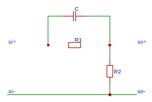

## 自动控制基本概念

### 自动控制定义

**自动控制**是指在**无人直接参与**的情况下，通过**控制器**使**被控对象或过程**自动地按照预定要求进行。

> 被控制的机器设备或物体，叫做**被控对象**
> 所用的控制装置常称为**控制器**
> 控制器和被控对象的组合称为**自动控制系统**

### 自动控制系统的分类

按结构可分为开环控制系统和闭环控制系统。

按输入信号可分为恒值控制系统、程序控制系统和随动系统

按描述元件的动态方程可分为线性系统和非线性系统

### 开环控制系统

若系统的输出量与输入量间不存在反馈的通道，这种控制方式称为开环控制系统。

### 闭环系统

凡是系统输出信号对控制作用有直接影响的系统，都称为闭环系统(又称反馈系统)。

### 闭环系统的组成

- 测量反馈元件——测量被控量并转换成与输入量同一物理量后，再反馈回输入端
- 比较元件——比较输入信号和反馈信号，并输出偏差信号
- 放大元件——将微弱信号线性放大
- 校正元件——变换信号以改善系统性能
- 执行元件——执行控制，以控制被控量
- 控制对象——需要进行控制的工作机械

### 开环系统与闭环系统的比较

开环系统的控制精度较低，但结构简单、造价较低，适用于没干扰的场合。

开环系统有反馈环节，可以用不太精密的元件构成较精密的系统，但设备增多，线路复杂。对一些惯性大的系统，还可能出现发散或等幅振荡等不稳定的情况。

### 自动控制系统的特征

1. 结构上，系统必须具有反馈装置，并按负反馈原则组成系统。
2. 由偏差产生控制作用
3. 控制的目的是减小或消除偏差，使被控量尽量接近期望值。

## 自动控制系统的基本要求

- 稳定性：系统恢复平衡状态的能力
- 准确性：输出的实际值与期望值之差
- 快速性：由原先平衡状态过渡到另一平衡状态的速度

> 稳、准、快

## 数学模型

数学模型的形式有微分方程、传递函数、频率特性、状态变量、结构图和信号流图等。

### 非线性方程的线性化

在平衡点附近进行**泰勒展开！**

### 传递函数

线性系统在初始条件为 0 时，输出量的拉氏变换与输入量的拉氏变换之比，称为该系统的传递函数，记为 $G(s)$

### 经典环节

1. 比例环节 $G(s) = K$
2. 积分环节 $G(s) = \frac{1}{Ts}$
3. 惯性环节 $G(s) = \frac{1}{Ts + 1}$
4. 振荡环节 $G(s) = \frac{1}{T^2s^2 + 2\zeta Ts + 1}$
5. 微分环节
    - 纯微分 $G(s) = s$
    - 一阶微分 $G(s) = \tau s + 1$
    - 二阶微分 $G(s) = \tau^2 s^2 + 2 \zeta \tau s + 1$
6. 延迟环节 $G(s) = e^{- \tau s}$

### 梅逊公式

$$
\begin{aligned}
&P = \frac{1}{\Delta} \sum ^n_{k=1} P_k \Delta _k \\
&\Delta = 1 - \sum L_a + \sum L_bL_c - \sum L_d L_e L_f + \dots 
\end{aligned}
$$
> $\sum L_a$ 等是不同回路的回路传输之和
> $P_k$ 是第 k 个前向通路
> $\Delta _k$ 是第 k 个前向通路特征式的余子式（除去与 $P_k$ 接触的 $\Delta$ 剩余部分）

## 稳定性

### 稳定性的定义

处于某一平衡态的一系统，在外作用下离开了稳态，当外作用消失后，若经过足够长时间，能恢复稳定状态，则称该系统具有 **稳定性** 。

### 线性稳定系统稳定的充要条件

系统特征方程的根均为负实数或具有负实部的共轭复数，即系统的闭环极点都在复数平面虚轴的左边。
> 系统的特征方程即令闭环传递函数的分母为零的方程，若给出开环传递函数，要先求闭环传递函数。

对一阶和二阶系统，特征方程各项系数为正是系统稳定的充分必要条件。  
对其它高阶系统只能求出根才能判断，所以往往采用 **劳斯判据** 判断。

#### 劳斯判据
1. 写出$s$的方程
2. 判断系数存在且均大于零（必要条件）  。
	方程缺项或具有负系数，则系统不稳定。
3. 编写劳斯计算表
$$
\left.
\begin{matrix} 
 s^n\\s^{n-1}\\s^{n-2}\\s^{n-3}\\ \vdots 
\end{matrix}
\right | 
\begin{matrix}
a_n & a_{n-2} & a_{n-4}\\
a_{n-1}  & a_{n-3} & a_{n-5}\\
b_1  & b_2 & \dots \\
c_1  & c_2 & \dots \\
\vdots \\
\end{matrix} 
$$
4. 按公式计算各系数
$$
b_1=\frac{-\begin{vmatrix}
a_n  & a_{n-2}\\
a_{n-1}  & a_{n-3}
\end{vmatrix}}{a_{n-1}} ,
b_2=\frac{-\begin{vmatrix}
a_n  & a_{n-4}\\
a_{n-1}  & a_{n-5}
\end{vmatrix}}{a_{n-1}} ,\dots
$$
$$
c_1=\frac{-\begin{vmatrix}
a_{n-1}  & a_{n-3}\\
b_1  & b_2
\end{vmatrix}}{b_1} ,
c_1=\frac{-\begin{vmatrix}
a_{n-1}  & a_{n-5}\\
b_1  & b_3
\end{vmatrix}}{b_1} ,\dots
$$
> 计算过程中可同乘一整行
5. 若特征方程全部系数为正，且劳斯表第一列为正，则系统稳定。（系统稳定的充要条件）     
	第一列符号改变 n 次，表明系统有 n 个正实部根。
	
> 若第一列中出现了 0 ，可以用一个小正数代替并继续计算
	
#### 改进不稳定系统的方法
1. 用反馈环节包围积分
2. 引入比例-微分环节 $\tau_ds+1$	

#### 稳定裕度
用最靠近虚轴的根与虚轴的距离 $\sigma$ 表示系统的稳定裕度。  
令$s=z- \sigma$，再应用劳斯判据判断是否稳定。

### 时间响应

一个控制系统的事件响应通常包括**瞬态响应**及**稳态响应**。

瞬态响应定义：时间变为很大时，其时间响应应趋于 0 的部分。

稳态响应定义：当时间达到无穷时的一种固定的响应。

### 典型输入信号

为了分析系统的稳定性，通常引入一些典型输入信号：
- 单位阶跃 $\frac{1}{s}$
- 单位斜坡 $\frac{1}{s^2}$
- 单位抛物线

### 阶跃响应的性能指标

- 延迟时间 $t_d$ ：输出第一次达到稳态值的 50% 所需时间
- 上升时间 $t_r$ ：响应第一次到达稳态值的时间
- 峰值时间 $t_p$ ：超过稳态值到达第一个峰值 $c_{max}$ 的时间
- 最大超调量 $\sigma ;\%$ ：最大值超出稳态值的百分比
- 调节时间 $t_s$ ：响应曲线到达并不再超出稳态值的误差带的最小时间，误差带取 $\pm 0.05c(\infty)$ 或 $\pm 0.02c(\infty)$
- 震荡次数 $N$
- 稳态误差 $e_{ss}$

### 一阶系统的动态性能指标

$$\Phi(s)=\frac {K}{Ts+1}$$

过渡时间 $t_s = 3T$

### 二阶系统

开环传递函数为 
$$G(s)=\frac{\omega _n^2}{s^2+2\zeta \omega_n s}$$

闭环传递函数为
$$\Phi(s)=\frac{\omega _n^2}{s^2+2\zeta \omega_n s + \omega _n^2}$$

#### 二阶系统的动态性能指标
以下是在欠阻尼状态下 $0<\zeta <1$ 的两个重要动态性能指标

最大超调量  
$$
\sigma \%  = \mathrm{exp} (- \pi  \zeta / \sqrt{1-\zeta ^2}) \times 100\%
$$

调节时间:   
$$t_s \approx \frac{3}{\zeta \omega_n} (\Delta=0.05)$$  
$$t_s \approx \frac{4}{\zeta \omega_n} (\Delta=0.02)$$

二阶系统的零点离极点越近，对阶跃响应的影响越大。

在二阶系统中引入比例微分环节可提高系统的动态品质。

### 高阶系统

$$\Phi(s)=\frac{K_g\prod_{j=1}^{m}(s+z_j)}{\prod_{k=1}^{r}(s^2+2\zeta_k\omega_ks+\omega_k^2) }$$

### 主导极点

左半复平面上离虚轴最近的共轭复极点或实极点。它们的附近没有零点，且系统的其它极点有的与邻近的零点相消，有的在上述极点左方很远，并离所有的零点也很远。这对极点就被称为闭环主导极点。

当引进的实数极点与主导极点的模之差大于 5 时，即可认为其为非主导极点。

开环放大系数不大时可略去较小的时间常数，但开环放大系数较大时略去时间常数则会引起较大误差。

#### 估算高阶系统动态性能的方法

1. 实数极点与主导极点的模之比大于 5 可忽略；
2. 极点附近有零点可互相约去；

### 稳态误差

误差有两种定义方式——从输入端定义和从输出端定义。

按开环传递函数中的积分环节个数可将系统分为 0 型系统，Ⅰ型系统和 Ⅱ型系统（又称有差系统、一阶无差度系统和二阶无差度系统）。

引入与给定作用有关或与扰动作用有关的附加控制作用可以减小给定误差或扰动误差。

#### 三种误差系数

- $$K_p=1+\lim_{s \to 0}G_K(s)$$
- $$K_V=\lim_{s \to 0}sG_K(s)$$
- $$K_a =\lim_{s \to 0}s^2G_K(s)$$

#### 给定输入信号作用下的系统稳态误差

- 单位阶跃输入
    $$e_{ss}=\frac{1}{K_p}$$
- 单位斜坡输入
	$$e_{ss}=\frac{1}{K_V}$$
- 单位抛物线输入
	$$e_{ss}=\frac{1}{K_a}$$

### 三种控制

> 一般不单独使用比例控制

- 比例控制 P
- 比例加微分控制 PD
- 比例加积分控制 PI （积分的作用是消除控制偏差的余差）
- PID

#### PID 分别的作用

P：减小稳态误差、提高控制精度
D：预见信号变化趋势，发出早期修正信号
I：提高无差度阶数，改善系统稳态性能

### 传递函数分析工具

- Matlab
- GNU Octave

## 频率分析

### 频率特性的定义

线性定常系统的频率特性是**零初始条件**下**稳态**输出正弦信号与输入正弦信号的复数比。

### 图示方法

- 幅相频率特性曲线（奈奎斯特图）
- 对数幅频/相频特性曲线（伯德图）
- 对数幅相频率特性曲线（尼柯尔斯图）

### 开环频率特性

低频段的幅相与系统的型别 $\nu$ 有关

$\nu$ | $A(0)$ | $\varphi (0)$
------|--------|------------
0|K|0
1|$\infty$|$- \pi / 2$
2|$\infty$|$- 2 \pi / 2$
$\nu$|$\infty$|$- \nu \pi / 2$

### 典型环节的频率特性

P198

### 最小相位系统

开环传递函数 $G(s)$ 的全部极点位于 s 平面的左半部，且没有零点落在右半 s 平面的系统称为最小相位系统。

> 最小相位系统的对数幅频特性与对数相频特性有一一对应关系：$L(\omega)$ 的斜率与 $\varphi(\omega)$ 成正相关。

最小相位系统满足如下关系式：

$$\lim_{\omega \to 0} \varphi(\omega)=-\nu\frac{\pi}{2}$$

$$\lim_{\omega \to \infty} \varphi(\omega)=-(n-m)\frac{\pi}{2}$$

> 式中，$\nu$ 为系统型别，$n$ 为传递函数分母多项式的阶数，$m$ 为分子多项式的阶数。

### 非最小相位系统

$G(s)$ 的全部极点在 s 平面的左半部，但有零点落在右半 s 平面上的系统称为非最小相位系统。

### 开环不稳定系统

$G(s)$ 有极点落在 s 平面右半部的系统称为开环不稳定系统。

### 乃氏判据

#### 辅助函数 

若令开环传递函数为

$$G_K(s)=\frac{N(s)}{D(s)}$$

> $N(s)$ 为分子多项式，$D(s)$ 为分母多项式。

其对应的闭环传递函数为

$$\Phi(s)=\frac{G(s)}{1+G_K(s)}=\frac{D(s)G(s)}{D(s)+N(s)}$$

由两者的特征多项式之比构造一个辅助函数：

$$F(s) = \frac{D(s)+N(s)}{D(s)} = 1 + G_K(s)$$

辅助函数具有以下特点：
1. 其零极点分别位闭环极点和开环极点
2. 零、极点个数相同
3. F 平面的坐标原点是 GH 平面的 (-1, j0) 点

#### 幅角定理

设某封闭曲线 $\Gamma$ 包围了 $F(s)$ 在 $s$ 平面的 $Z$ 个零点和 $P$ 个极点，则当 $s$ 以顺时针沿 $\Gamma$ 移动一周时，在 $F$ 平面的像 $\Gamma'$ 将以顺时针绕原点旋转 $N$ 圈。那么有如下关系：

$$N=Z-P$$

#### 奈奎斯特判据

为确定 $F(s)$ 在右半平面上的零、极点，需要构造**奈奎斯特曲线** $\Gamma$，$\Gamma$ 由以下三段组成：
1. 正虚轴
2. 半径为无限大的右半圆
3. 负虚轴

对应的 $\Gamma'$ 为以下三段：
1. $G_K(j\omega)$ 右移一个单位
2. $F(s) \to 1$
3. 频率特性对称于实轴的镜像 

 于是根据 $\Gamma'$ 可以确定 $\Gamma$ 包围的零、极点，亦即系统的闭环极点和开环极点。由[幅角定理](#幅角定理)得
 
 $$Z=N+P$$

又已知[闭环稳定系统的充要条件](#线性稳定系统稳定的充要条件)是极点全部在 $s$ 平面的左半部，即

$$Z=0=N+P$$

即  $$N=-P$$

所以可得奈氏判据的内容：

闭环稳定系统稳定的充要条件为：在 $GH$ 平面上的开环频率特性曲线 $G_K(j \omega)$ 及其镜像当 $\omega$ 从 $-\infty$ 变化到 $+\infty$ 时，将以逆时针方向绕 $(-1,j0)$ 点 $P$ 圈。

> $P$ 即开环特性在右半平面的极点

#### 奈氏判据的变式

为简便起见，可以只画出 $\omega \to +\infty$ 的曲线，并补充 $\omega=0$ 的曲线，此时的闭环极点数为

$$Z=2N'+P$$

还有一种正负穿越的变式：

$$Z = 2(N'_- - N'_+) + P$$

> $N'_-$ 为负穿越，即从上至下的穿越负实轴 $(-\infty \sim -1)$ 区域；$N'_+$ 为正穿越，即从下至上地穿越负实轴 $(-\infty \sim -1)$

在伯德图上也可以用该式判断，其中 $N'_-$ 和 $N'_+$ 分别是 $L(\omega)>0$ 区域内的相频特性的负穿越次数和正穿越次数。

### 稳定裕度

#### 定义

相角裕度：  
$$\gamma=\varphi(\omega_c)-(-180\degree)=180\degree+\varphi(\omega_c)$$

幅值裕度：  
$$h_g=\frac{1}{A(\omega_g)}$$

对数幅值裕度：  
$$L_g=20\mathrm{lg}h_g$$

#### 物理意义

##### 相角裕度
稳定系统在截止频率处若相角再滞后 $\gamma$ 角度，系统将处于临界状态。

##### 幅值裕度  
稳定系统的放大倍数再增大 $h_g$ 倍，则系统在[乃氏图](#乃氏判据)上的曲线正好通过 $(-1,j0)$ 点，系统处于临界稳定状态。

### 开环频率特性与系统性能的关系

#### 低频段与稳态误差

$L(\omega)$ 的**低频渐进线**的斜率可反映**系统的型别**，渐近线与 $\omega$ 轴的交点可以反映系统的开环传递系数，从而可求得系统的**稳态误差**。

#### 中频段与系统稳定性

对于如下系统：

$$G(s)=\frac{K(T_1s+1)}{s^2(T_2s+1)}, T_1>T_2$$

其最大相角裕度将在 $\omega_c=\sqrt{\omega_1\omega_2}$ 处取到，其值为：

$$\gamma_m=\mathrm{arctan}\sqrt{h}-\mathrm{arctan}\frac{1}{\sqrt{h}}$$

其中 $h$ 是中频段宽度，由上式可得中频段越宽，最大相角裕度越大，系统相对稳定性越高。

#### 频域指标与时域指标

频域指标指的是相角裕度 $\gamma$ 和截止频率 $\omega_c$，时域指标指的是超调量 $\sigma\%$ 和调节时间 $t_s$。

对一个二阶系统
$$G(s)=\frac{\omega^2_n}{s(s+2\zeta\omega_n)}$$

经过一通计算可以得到：
$$\gamma=\arctan{\frac{2\zeta}{\sqrt{\sqrt{4\zeta^4+1}-2\zeta^2}}}$$

又由[上文的时域分析](#二阶系统的动态性能指标)可得：
$$\sigma\%=e^{-\pi\zeta/\sqrt{1-\zeta^2}}\times100\%$$

**由此可得，$\gamma$ 越小，$\zeta$ 越小，$\sigma\%$ 越大。一般希望 $30\degree\le\gamma\le60\degree$。**

> 此处最好附上三者的关系图

同样地，可以得到：
$$t_s\omega_c=\frac{6}{\tan\gamma}$$

**即在 $\gamma$ 一定时，$\omega_c$ 越大，$t_s$ 越小。**

> 同样地，这里也应该附张图

在**高阶系统**中有如下近似公式：

$$\sigma\%=[0.16+0.4(\frac{1}{\sin\gamma}-1)]\times100\%\quad(35\degree\le\gamma\le90\degree)$$

$$t_s=\frac{\pi}{\omega_c}[2+1.5(\frac{1}{\sin\gamma}-1)+2.5(\frac{1}{\sin\gamma}-1)^2] 
\quad(35\degree\le\gamma\le90\degree)$$

#### 高频段与系统性能

在高频段，一般有 $20\lg|G(j\omega)|\ll 0$，即 $|G(j\omega)|\ll 1$，故
$$|\Phi(j\omega)|=\frac{|G(j\omega)|}{|1+G(j\omega)|}\approx |G(j\omega)|$$

即高频段的闭环幅频特性近似于开环幅值特性。

**所以 $L(\omega)$ 反映系统对输入端高频信号的抑制能力，高频段的分贝值越低，衰减作用越大，抗干扰能力越强。**

## 控制系统的校正

### 基本概念

- 校正：用于改善系统性能的过程
- 校正装置：用于校正的环节

### 校正方式

按位置可分为：
- 串联校正
- 并联校正

### 常用校正装置

#### 超前校正装置

传递函数为：
$$G_c(s) = \alpha \frac{Ts+1}{\alpha Ts +1}$$

> 其中，$\alpha=\frac{R_2}{R_1+R_2},T=R_1C$

用放大倍数为 $\frac{1}{\alpha}$ 的放大器补偿衰减后的传递函数为：
$$G_c(s) = \frac{Ts+1}{\alpha Ts +1}$$

##### 特点
- 在 $1/T$ 到 $1/(\alpha T)$ 之间 $L(\omega)$ 的斜率为 $+20\mathrm{dB/dec}$，对输入信号有微分作用。
- 输出信号的相位总是超前于输入信号。

##### 参数

$$\omega_m = \frac{1}{T\sqrt{\alpha}} = \sqrt{\omega_1 \omega_2}$$

> $\omega_1 = 1/T$，$\omega_2=1/(\alpha T)$

$$\varphi_m = \mathrm{arcsin} \frac{1/\alpha - 1}{1/\alpha + 1}$$

$$\frac{1}{\alpha} = \frac{1+\mathrm{sin}\varphi_m}{1-\mathrm{sin}\varphi_m}$$

> 可以看出 $\alpha$ 越小，微分作用越强，$\varphi_m$ 越大，干扰也增大。
> 实际选用的 $\alpha$ 一般不小于 $0.05$

#### 滞后校正装置

网络传递函数为：

$$G_c(s)=\frac{Ts+1}{\beta Ts+1}$$

其中 $\beta = (R_1+R_2)/R_2$，$T=R_2C$

##### 特点

- 对低频信号无衰减，对高频信号有明显削弱，$\beta$ 越大，衰减越甚，高频噪声电平越低。
- 在 $\omega = 1/(\beta T) \sim 1/T$ 时，对数幅频曲线斜率为 -20 dB/dec，即对输入信号有积分作用。
- 在所有频率下，相位总为负值，即输出信号总滞后于输入信号。

##### 参数

$$\omega_m=\frac{1}{T\sqrt{\beta}}$$

$$\varphi_m = \arctan{\frac{1-\beta}{2\sqrt{\beta}}}$$

$$\omega_2=\frac{1}{T} = \frac{\omega'_c}{10}$$

#### 滞后-超前校正装置

滞后超前校正装置兼有超前校正装置和滞后校正装置的优点，适合在稳态和动态性能要求均很高的系统中作校正之用。

### 校正装置的设计

#### 串联超前校正网络

1. 根据稳态误差要求，确定系统开环传递系数（见[#稳态误差](#稳态误差)）。然后绘制伯德图，求出未校正的相角裕度 $\gamma_0$ 和幅值裕度 $L_{g0}$。

2. **确定截止频率 $\omega'_c$ 和 $\alpha$：**  
	- 若已给定 $\omega'_c$，则根据公式 $L_0(\omega'_c)+10\mathrm{lg}\frac{1}{\alpha}=0$ 求出 $\alpha$
	- 若未给定 $\omega'_c$，则先确定 $\varphi_m=\gamma' - \gamma + \Delta$。然后算出 $\alpha = \frac{1-\mathrm{\varphi_m}}{1+\mathrm{\varphi_m}}$，再从原系统的伯德图中求出对应的截止频率 $\omega'_c$
	  > $\Delta$ 一般取 5，$\alpha  \ge 0.05$

3. 求时间常数并写出传递函数：  
	$$T=\frac{1}{\omega_m\sqrt{\alpha}}$$
	$$G_c(s)=\frac{Ts+1}{\alpha Ts+1}$$

4. **验证要求**  
	根据 $$\varphi_m = \mathrm{arcsin} \frac{1/\alpha - 1}{1/\alpha + 1}$$ 求得 $\varphi_m$ 后验算相角裕度。

5. **确定元件参数**  
	$$\left\{\begin{matrix}
	\alpha=\frac{R_2}{R_1+R_2}
	\\T=R_1C
	\end{matrix}\right.$$
	一般先确定电容（如选 $1\mu F$），然后根据上式确定电阻。

> 超前校正的关键在于利用超前网络的正相角来提高相角裕度，利用其对数幅频特性的正斜率来提高截止频率。

> 一般，若要求系统响应过程快，超调量小，则可以使用串联超前校正。

#### 串联滞后校正网络

> 串联滞后校正是通过降低系统的截止频率来获得足够的相角裕度，当系统的快速性要求不高，抗干扰性能要求较高时，可采用串联滞后校正。

1. 先根据稳态误差要求确定开环放大系数 $K$，然后绘制伯德图，确定未校正系统的截止频率、相角裕度和幅值裕度。  

2. 由 $\gamma(\omega'_c)=\gamma'+\Delta'$ 确定原系统在新截止频率下的相角裕度。（$\Delta$ 一般取 $5\degree \sim 12\degree$）

3. 根据 $\gamma(\omega'_c)$ 在原系统中找出 $\omega'_c$。

4. 由 $L_0(\omega'_c)+20\mathrm{lg}1/\beta=0$ 求出 $\beta$。

5. 取 $\omega_2=\frac{1}{T}=(\frac{1}{10}\sim\frac{1}{2})\omega'_c$，并算出 $T$

6. 由 $\beta$ 和 $T$ 可得传递函数。

7. 由 $\beta = \frac{R_1+R_2}{R_2}$, $T=R_2C$ 求出元件参数。

---------------------------

## 关键考点

1. 频率响应特性定义

	线性定常系统的频率特性是初始条件下稳态输出正弦信号与输入正弦信号的复数比。

2. 传递函数与频率特性的关系？如何转化？

	关系为：$G(j\omega)=G(s)|_{s=jw}$
	   
	当传递函数中的复变量 $s$ 用 $j \omega$ 代替时，传递函数就转变为频率特性。 反之亦然。

3. 频率分析法进行控制/系统分析时具有什么优点？

	1. 只要求出系统的开环频率特性，就可以迅速判断闭环系统是否稳定。

	2. 系统频率特性与系统时域指标，如超调量、调节时间、谐振峰值等之间存在对应关系，因此频率特性容易与系统结构和参数联系起来，进行时域指标设计

	3. 频率特性既可以通过微分方程和传递函数求得，也可以通过实验方法求得。

	课件上的回答：
	1. 频率响应法的优点之一在于它可以通过实验量测来获得，而不必推导系统的传递函数。
	2. 频率响应法的优点之二在于它可以用图来表示，这在控制系统的分析和设计中有非常重要的作用。

4. 频率特性图有几种表示方法？

	1. 极坐标图，奈奎斯特（Nyquist）图
	2. 对数坐标图，伯德（Bode）图
	3. 对数幅相频率特性图，也叫尼克尔斯（Nichols）图

5. 波特图，奈氏图重要图形特征的对应关系？  

	乃氏图的 $(-1, j0)$ 对应波特图上 $L(\omega) = 0 \mathrm{dB}$ 的水平线和 $\varphi(\omega)= 0\mathrm{dB}$ 的水平线。

6. 对数坐标图的特点是什么？

	横坐标上每一线性单位表示频率的十倍变化， 称为十倍频程，即在横轴上等距的 $\omega$ 之间成等比关系
	
	把真数（幅值）相乘变为对数（lg|A(jw)|）相加，原本的幅值相乘变为幅值对数相加

	优点：
	1. 可以展宽频带；频率是以10倍频表示的，因此可清楚的表示出低频、 中频和高频段的幅频和相频特性。
	2. 可以将乘法运算转化为加法运算。
	3. 所有的典型环节的频率特性都可以用分段直线(渐进线)近似表示。
	4. 对实验所得的频率特性用对数坐标表示，并用分段直线近似的方法，可以很容易的写出它的频率特性表达式。

7. 最小相位系统的定义？

	函数G(s)的全部极点均位于s平面的左半部分 ，而没有零点落在右半s平面。具有这种传递函数的系统为最小相位系统。

8. 辅助函数的特点？如何判断系统的稳定性  

	1. 辅助函数 $F(s)$ 是闭环特征多项式与开环特征多项式之比，故其零点和极点分别为闭环极点和开环极点。
	
	2. $F(s)$ 的零点、极点的个数相同，均为 n 个。
	
	3. $F(s)$ 与开环传递函数 $G_K(s)$ 之间只差常量 1。$F(s)=1+G_K(s)$ 的几何意义为：F平面上的坐标原点就是 GH 平面上的 $(-1,j0)$ 点。

4. 奈奎斯特稳定性判据？

	[详见奈奎斯特判据章节](#奈奎斯特判据)

10. 基于波特图的稳定性判据

	$$Z = 2(N'_- - N'_+) + P$$

	其中 $N'_-$ 和 $N'_+$ 分别是 $L(\omega)>0$ 区域内的相频特性的负穿越次数和正穿越次数。

	系统稳定充要条件为 $2(N'_- - N'_+) + P = 0$

11. 波特图上稳定裕度的物理意义

	**相角稳定裕度的物理意义在于：**   
	稳定系统在截止频率 $\omega$ 处若相角再滞后一个 $\gamma$ 角度，则系统处于临界状态；若相角滞后大于 $\gamma$ 系统将变成不稳定。

	**幅值裕度 $h_g=1/A(\omega_g)$ 的物理意义在于：**  
	稳定系统的传递系数(放大倍数)增大 $h_g$ 倍，则 $\omega$ 处的幅值 $A(\omega)$ 将等于 1，曲线正好通过 (- 1,j0) 点，系统处于临界稳定状态;若传递系数增大 $h_g$ 倍以上，系统将变成不稳定。

12. 开环伯德图与系统性能的关系？

	通过波特图可以求出截止频率和相角裕度，根据它们与时域下的性能指标之间的关系，可以求出超调量和调节时间等。

	> 详见 [开环频率特性与系统性能的关系](#开环频率特性与系统性能的关系)

13. 校正的基本概念？常用校正装置的特点

	校正即采用适当方式，在系统中加入一些参数可调整的装置(校正装置)，用以改变系统结构，进一步提高系统的性能，使系统满足性能指标要求。

	> 校正装置是为保证系统能达到预期的控制性能指标要求而有目的地增添的装置。

	特点见[校正装置相关章节](#常用校正装置)

	或参考以下描述：

	1. 串联超前校正特点：

		相角超前、幅值大于分贝，用于提高系统的相角裕度；
		
		保持低频段，使系统满足稳态精度e~ss~；
		
		改善中频段，是系统动态性能提高（w~c~↑，γ↑）
		
		抬高了高频段，使系统抗高频干扰的能力降低。
       
	1. 串联滞后校正特点：

		幅值衰减，利用幅值衰减特性挖掘系统自身的相角储备
		
		保持低频段， 满足稳态精度e~ss~
		
		降低中频段，w~c~↓，γ↓，损失快速性，改善均匀性
		
		压低高频段 提高抗高频干扰能力

14. 串联超前校正和串联滞后校正的特点比较？

	- 超前校正利用其相位超前特性、获得系统所需要的相位超前量。而滞后校正 则利用其高频衰减特性，使截止频率下降，借助于原系统在新的截止频率处的相位，获得系统所需要的相位裕度。

	- 超前校正通常用来改善稳定裕度，滞后校正通常用来提高稳态精度。

	- 超前校正比滞后校正能提供更高的截止频率。高的截止频率意味着大的带宽，从而意味着小的调整时间。因此，如果希望系统具有大的带宽，或者快的响应，应采用超前校正。

	- 超前校正需要由一个附加的增益增量，以抵消超前网络本身的衰减。则表明超前校正比滞后校正需要更大的增益。在多数情况下，增益越大，意味着系统的体积和重量越大，成本越高，同时会在系统中产生比较大的信号，这种大信号容易造成元件的饱和现象。

	- 滞后校正降低了系统在高频区的增益，但并没有降低系统在低频区的增益。 因为降低了高频增益，系统的总增益可以增加，从而低频增益随之增加，因此改善了系统的稳态精度。

	另一种讲法：

	- 串联超前校正是通过将校正环节的超前相位叠加进需要校正系统，虽然 $\omega_c$ 后移会导致本身系统的相位变低，但是可以通过增大校正环节来弥补，从而获得高的相角裕度。但因为校正网络的对数对数幅频曲线在高频时大于0，使系统不利于抗高频干扰。

	- 串联滞后校正时通过将校正环节的对数幅值叠加进需要校正的系统，使得 $\omega_c$ 前移，本身系统在 $\omega$ 较小时相角裕度较大，所以相角裕度增加，叠加进系统的校正环节的相位为负值，需要 $\omega_c$ 更加前移进行弥补，但一般弥补小于 6°。因为校正网络在对数幅频曲线高频时小于 0，所以提高了系统抗高频干扰的能力。

## 参考资料

[1] 高国燊, 余文烋, 彭康拥, 等. 自动控制原理[M]. 第四版. 广州:华南理工大学出版社, 2013.
